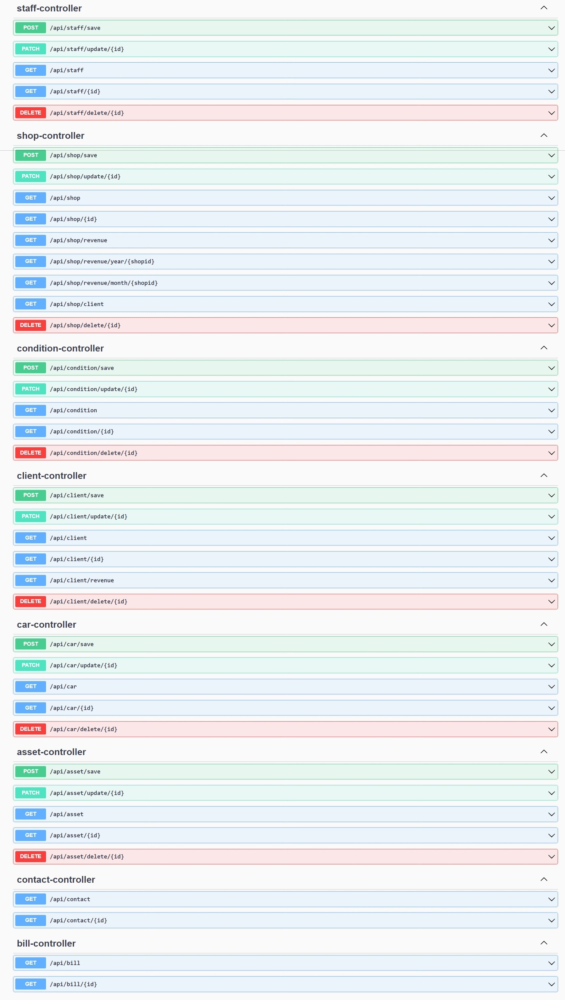
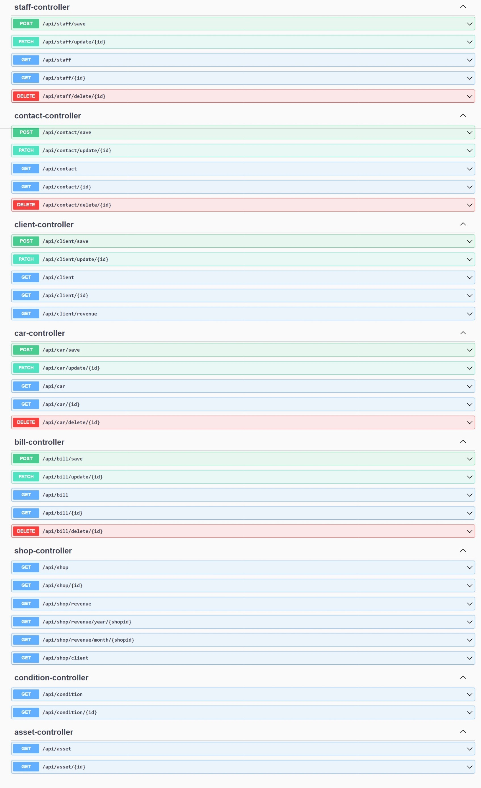
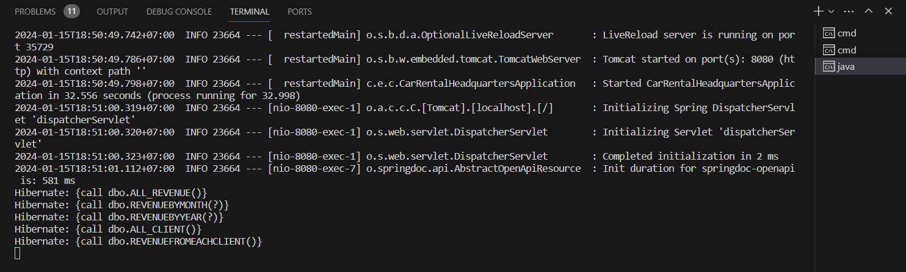
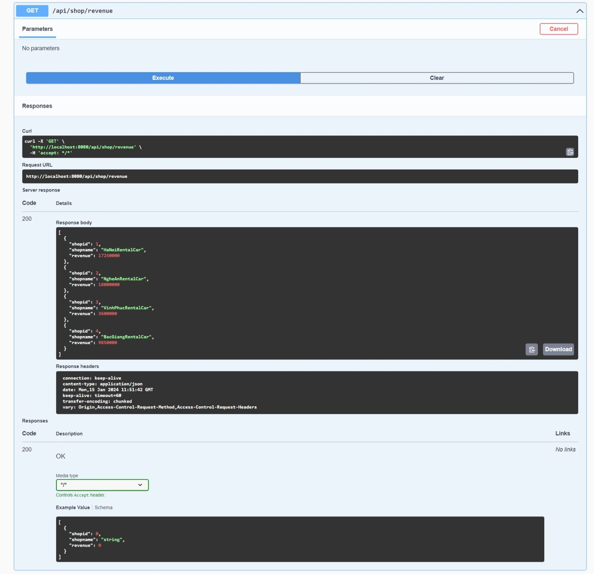
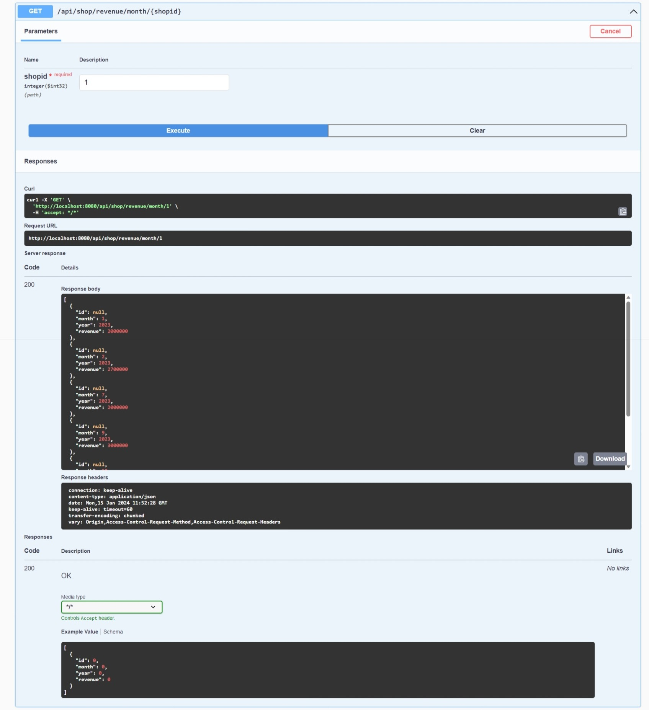
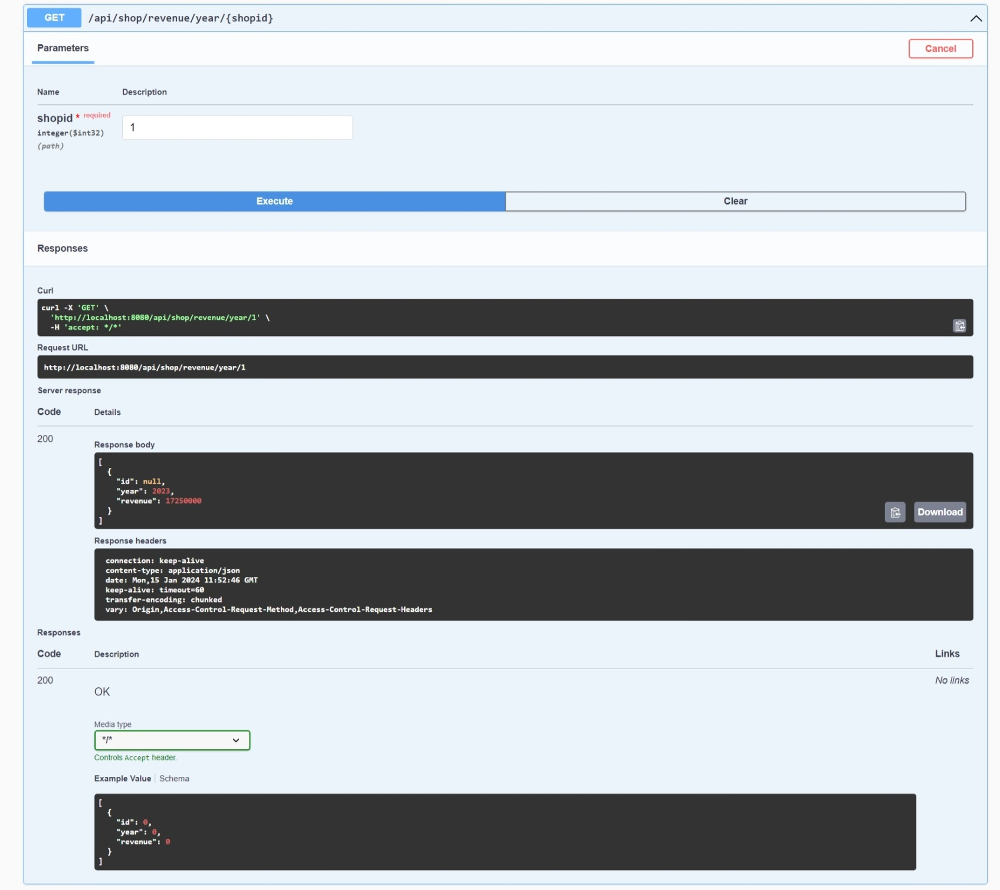
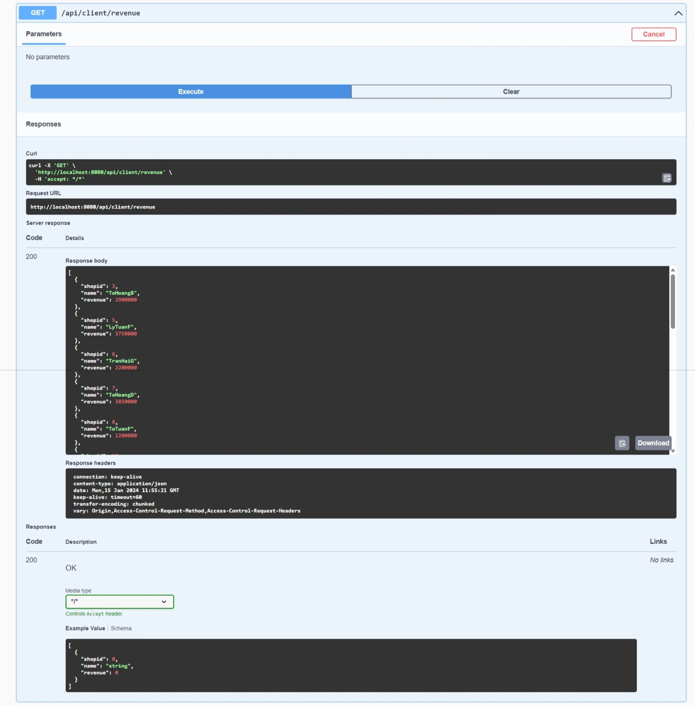

<a name="readme-top"></a>
<!-- TABLE OF CONTENTS -->
<details>
  <summary>Table of Contents</summary>
  <ol>
    <li>
      <a href="#about-the-project">About The Project</a>
      <ul>
        <li><a href="#built-with">Built With</a></li>
      </ul>
    </li>
    <li>
      <a href="#getting-started">Getting Started</a>
      <ul>
        <li><a href="#prerequisites">Prerequisites</a></li>
        <li><a href="#installation">Installation</a></li>
        <li><a href="#project-setup">Project Setup</a></li>
      </ul>
    </li>
    <li><a href="#key-features">Key Features</a></li>
    <li><a href="#api-documentation">API Documentation</a></li>
    <li><a href="#usage">Usage</a></li>
    <li><a href="#contact">Contact</a></li>
  </ol>
</details>

# About The Project
A distributed application to manage a car rental agency with multiple branches nationwide.

## Built With
* [![Java][Java-shield]][Java-url]
* [![Spring][Spring-shield]][Spring-url]
* [![Apache Maven][Apache Maven-shield]][Apache Maven-url]
* [![Apache Tomcat][Apache Tomcat-shield]][Apache Tomcat-url]
* [![Swagger][Swagger-shield]][Swagger-url]
* [![Microsoft SQL Server][MicrosoftSQLServer-shield]][MicrosoftSQLServer-url]

<p align="right">(<a href="#readme-top">back to top</a>)</p>

# Getting Started

## Prerequisites
* [Java SE Development Kit 17](https://www.oracle.com/java/technologies/downloads/#java17): Of course you need to have Java installed to run a Java application. I used Java 17, but I think it works fine with other versions as well.
* [IntelliJ IDEA](https://www.jetbrains.com/idea/download/?section=windows): It is undoubtedly the top-choice IDE for software developers. It makes Java and Kotlin development a more productive and enjoyable experience.
* [Swagger 3](https://swagger.io/): an open source project used to generate the REST API documents for RESTful web services. It provides a user interface to access our RESTful web services via the web browser.
* [Microsoft SQL Server 2022](https://www.microsoft.com/en-us/sql-server/sql-server-2022): a relational database management system developed by Microsoft.
As a database server, it is a software product with the primary function of storing and retrieving data as requested by other software applications - 
which may run either on the same computer or on another computer across a network (including the Internet).
* [SQL Server Management Studio](https://learn.microsoft.com/en-us/sql/ssms/download-sql-server-management-studio-ssms?view=sql-server-ver16): SSMS is an integrated environment for managing any SQL infrastructure, from SQL Server to Azure SQL Database. SSMS provides tools to configure, monitor, and administer instances of SQL Server and databases. Use SSMS to deploy, monitor, and upgrade the data-tier components used by your applications and build queries and scripts.
* [Radmin VPN](https://www.radmin-vpn.com/): a free and easy-to-use software product to create virtual local networks. The program allows users to securely connect computers, located behind firewalls.

## Installation
You can install this application by cloning this repository into your current working directory:
```sh
git clone https://github.com/theEmperorofDaiViet/car-rental.git
```

## Project Setup

### Project Explorer
- [/car-rental-headquarters](/car-rental-headquarters) - the application installed at the headquarters of the car rental agency.
- [/car-rental-branch](/car-rental-branch) - the application installed at each branch.

All SQL script files are located in [/src/main/resources/database](/) of both [headquarters](/car-rental-headquarters/src/main/resources/database) and [branch](/car-rental-branch/src/main/resources/database) application.

### Create a VPN
Create a network by Radmin VPN. Make sure that all computers at the headquarters and at each branch are online and joined this network.

### Firewall Configurations
Add inbound rules for the SQL Server ports to allow access, or simply turn off the firewall if you don't mind.

### Database Configurations
Run the ***SQL Server 2022 installer*** and create an instance of SQL Server for the headquarters and each branch:
- Use the **Developer** Edition.
- Select the *Database Engine Services* and *SQL Server Replication* feature.
- Use **Mixed Mode** for Authentication Mode and specify the password for the *sa* account.

Open ***SQL Server Configuration Manager***. Select *SQL Server Network Configuration*: enable TCP/IP and specify IP address (in the VPN created before) & SQL Server port of each computer.

Open ***SQL Server Management Studio***.

Create the database at the headquarters using [*this script*](/car-rental-headquarters/src/main/resources/database/schema/CarRentalShop.sql). You can generate some dummy data using python and sql scripts under the [/data](/car-rental-headquarters/src/main/resources/database/data) directory.

Then, distribute the database to each branch by *Database Replication & Fragmentation*:
- Create a folder named :open_file_folder:*REPLDATA* as the ***snapshot folder***. Share the folder to *Everyone* and set the permission level to *Read/Write*.
- Configure the ***Distributor*** using the wizard in SSMS or [*SQL script*](/car-rental-headquarters/src/main/resources/database/pub-sub/ConfigureDistribution.sql).
- Create a ***Merge Publication*** using the wizard in SSMS or [*SQL script*](/car-rental-headquarters/src/main/resources/database/pub-sub/CreatePublication.sql).
- Create a ***Subscription*** for each branch using the wizard in SSMS or [*SQL script*](/car-rental-headquarters/src/main/resources/database/pub-sub/NewSubscription.sql).

Don't forget to turn on the ***SQL Server Agent*** service.

Open the headquarters database, create ***stored procedures*** and ***triggers*** using SQL scripts under the [/stored procedures](/car-rental-headquarters/src/main/resources/database/stored%20procedures) and [/triggers](/car-rental-headquarters/src/main/resources/database/triggers) directory.

Open each branch database, create ***stored procedures*** and ***triggers*** using SQL scripts under the [/stored procedures](/car-rental-branch/src/main/resources/database/stored%20procedures) and [/triggers](/car-rental-branch/src/main/resources/database/triggers) directory.

### Spring Boot Application Configurations
Open the **application.properties** file in [/src/main/resources](/) of both [headquarters](/car-rental-headquarters/src/main/resources/application.properties) and [branch](/car-rental-branch/src/main/resources/application.properties) application and change the property values about the datasource to fit your own settings.

### Run the Application
Run the application in the IDE, or open a terminal in the root of the application and type the following command:
```sh
mvnw spring-boot:run
```
It runs on port 8080 by default. Visit [*http://localhost:8080/api-docs*](http://localhost:8080/api-docs) for the **api-docs** and [*http://localhost:8080/swagger-ui/index.html*](http://localhost:8080/swagger-ui/index.html) for the **Swagger UI** to visualize and interact with the API.

<p align="right">(<a href="#readme-top">back to top</a>)</p>

# Key Features
- Distributed Database over a VPN: 
  - Database Replication & Fragmentation
  - Stored Procedures & Triggers
+ API:
  + Basic CRUD operations
  + Calling Stored Procedures from Spring Data JPA Repositories

<p align="right">(<a href="#readme-top">back to top</a>)</p>

# API Documentation
<table>
  <tr>
    <th><h2 align="center">Headquarters</h2></th>
    <th><h2 align="center">Branch</h2></th>
  </tr>
  <tr>
    <td valign="top"></td>
    <td valign="top"></td>
  </tr>
</table>

# Usage
***Example:*** calling stored procedures from the headquarters application
<p align="center">
    
</p>

***Result:***
<p align="center">
    
    
    
    
    
</p>

<p align="right">(<a href="#readme-top">back to top</a>)</p>

# Contact
You can contact me via:
* [![GitHub][GitHub-shield]][GitHub-url]
* [![LinkedIn][LinkedIn-shield]][LinkedIn-url]
* ![Gmail][Gmail-shield]:&nbsp;<i>Khiet.To.05012001@gmail.com</i>
* [![Facebook][Facebook-shield]][Facebook-url]
* [![Twitter][Twitter-shield]][Twitter-url]

<br/>
<p align="right">(<a href="#readme-top">back to top</a>)</p>

<!-- MARKDOWN LINKS & IMAGES -->
<!-- Tech stack -->
[Java-shield]: https://img.shields.io/badge/Java-ED8B00?style=for-the-badge&logo=java&logoColor=white
[Java-url]: https://www.java.com/
[Spring-shield]: https://img.shields.io/badge/spring-%236DB33F.svg?style=for-the-badge&logo=spring&logoColor=white
[Spring-url]: https://spring.io/
[Apache Maven-shield]: https://img.shields.io/badge/Apache%20Maven-C71A36?style=for-the-badge&logo=Apache%20Maven&logoColor=white
[Apache Maven-url]: https://maven.apache.org/
[Apache Tomcat-shield]: https://img.shields.io/badge/apache%20tomcat-%23F8DC75.svg?style=for-the-badge&logo=apache-tomcat&logoColor=black
[Apache Tomcat-url]: https://tomcat.apache.org/
[Swagger-shield]: https://img.shields.io/badge/Swagger-85EA2D?style=for-the-badge&logo=Swagger&logoColor=white
[Swagger-url]: https://swagger.io/
[MicrosoftSQLServer-shield]: https://img.shields.io/badge/Microsoft%20SQL%20Sever-CC2927?style=for-the-badge&logo=microsoft%20sql%20server&logoColor=white
[MicrosoftSQLServer-url]: https://www.microsoft.com/en-us/sql-server

<!-- Contact -->
[GitHub-shield]: https://img.shields.io/badge/github-%23121011.svg?style=for-the-badge&logo=github&logoColor=white
[GitHub-url]: https://github.com/theEmperorofDaiViet
[LinkedIn-shield]: https://img.shields.io/badge/linkedin-%230077B5.svg?style=for-the-badge&logo=linkedin&logoColor=white
[LinkedIn-url]: https://www.linkedin.com/in/khiet-to/
[Gmail-shield]: https://img.shields.io/badge/Gmail-D14836?style=for-the-badge&logo=gmail&logoColor=white
[Facebook-shield]: https://img.shields.io/badge/Facebook-%231877F2.svg?style=for-the-badge&logo=Facebook&logoColor=white
[Facebook-url]: https://www.facebook.com/Khiet.To.Official/
[Twitter-shield]: https://img.shields.io/badge/Twitter-%231DA1F2.svg?style=for-the-badge&logo=Twitter&logoColor=white
[Twitter-url]: https://twitter.com/KhietTo